# Overview-of-ChatGPT
# 1. ChatGPT发布之前

## 1.1 GPT系列的发展历程

### 1.1.1GPT- 1 到GPT- 3 ：进展与里程碑

2018 年 6 月，OpenAI发布了第一版GPT（Generative Pre-trained Transformer）
模型，即GPT-1[1]。它包含了117M个参数和 12 个Transformer Encoder层。其主要
特点是将无监督的预训练和有监督的微调相结合。该方法很好的使对话模型取得了
优异的泛化能力，而不再需要对不同类型任务采取不同的模型架构。此后OpenAI
发布的GPT- 2 和GPT- 3 同样延续着该技术思路。GPT- 1 在处理英文的多项选择和填空
问题中表现出色，但生成文本的质量较低，缺乏连贯性和逻辑性。GPT- 1 奠定了GPT
系列的基础，是NLP领域中第一个引入Transformer架构进行预训练的模型，引发了
对预训练语言模型的广泛研究。

2019 年 2 月，OpenAI发布了GPT- 2 。相较于GPT- 1 ，它使用了更大规模的
预训练数据和更多的训练迭代次数，从而取得了显著的性能提升[2]。它包含了1.5B
个参数和 24 个Transformer Encoder层。GPT- 2 在自然语言生成和语言理解的任务中
表现出色，生成的文本更加具有连贯性与逻辑性，此外还能完成文本补全，问答和
翻译等任务。成为了GPT领域的重大突破。

2020 年 6 月，OpenAI发布了GPT- 3 。其规模远超前两个版本，包含了175B
个参数和 96 个Transformer Encoder层[3]。拥有了语境学习(In-context learning)的能
力，通过结合上下文获得提示（prompt），使模型根据文本的要求学习执行不同任
务。同时，在输出文本的连贯性和逻辑性上进行了优化，可以与正常人类相媲美。
GPT- 3 的发布被认为是NLP领域的重要的里程碑。
模型|发布时间|参数量|预训练数据量
--|--|--|--
GPT-1|2018年6月|1.17亿|约5GB
GPT-2|2019年2月|15亿|40G
GPT-3|2020年6月|1750亿|45TB

### 1.1.2 Transformer架构在自然语言处理中的作用
GPT的基础模型采用Transformer架构。Transformer是基于self-attention的深度神经网络模型[4]。与传统的RNN不同，Transformer能够高效的进行并行训练。原因有两个：其一是因为自注意力机制（Self-Attention Mechanism）的并行计算，它允许模型对输出序列中的每个位置都可以关注到其他位置的信息，捕捉全局的上下文信息，可以对输入序列中的所有位置进行独立的计算。其二是因为层与层之间的解耦，由于每个层之间是相互独立的，即每个层的计算只依赖于上一层的输出，因此每个层都可以被独立的计算。

  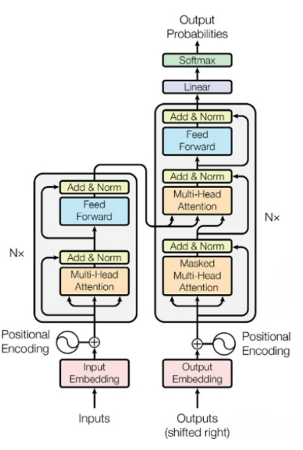

以上是Transformer的内部结构图。Transformer由解码器和编码器组成，编码器用于将输入序列映射到一组编码信息矩阵，解码器则将该信息矩阵转换为目标序列。编码器和解码器都由多层的自注意力模块和前馈神经网络模块组成。其中自注意力模块可以捕捉数据间的内部相关性，即在处理每个位置的信息时，模型会计算单词间的互相影响。这种机制使得 Transformer模型能够有效地处理长距离依赖问题。其中Feed Forward层可以通过线性变换，将数据先映射到高维空间后再映射到低维空间，便于更加深入的提取特征。

相较于传统架构，基于Transformer的架构能够支持具有足够参数的大规模数据训练集；具有更好的全局交互机制；编码器-解码器的结构和多头注意力机制能够使模型关注不同的子空间，捕捉不同模态数据之间的关联性，使得transformer模型有机会建立多模态数据统一框架，高效地提高工作性能。

## 1.2 预训练和微调机制
### 1.2.1 GPT模型的训练数据和方法

GPT-1：GPT-1的训练数据使用了BooksCorpus数据集，这个数据集包含7000本没有发布的书籍。作者选这个数据集的原因有两个：1. 数据集拥有更长的上下文依赖关系，使得模型能学得更长期的依赖关系；2. 这些书籍因为没有发布，所以很难在下游数据集上见到，更能考验模型的泛化能力。训练方法分为无监督的预训练和有监督的微调（fine-tuning）两个部分。GPT-1的无监督预训练是基于语言模型进行训练的，先给定一个无标签的序列<math xmlns="http://www.w3.org/1998/Math/MathML" display="block">  <mi>&#x3BC;</mi>  <mo>=</mo>  <mrow data-mjx-texclass="INNER">    <mo data-mjx-texclass="OPEN">{</mo>    <msub>      <mi>&#x3BC;</mi>      <mrow>        <mn>1</mn>      </mrow>    </msub>    <mo>,</mo>    <mo>.</mo>    <mo>.</mo>    <mo>.</mo>    <mo>,</mo>    <msub>      <mi>&#x3BC;</mi>      <mrow>        <mi>n</mi>      </mrow>    </msub>    <mo data-mjx-texclass="CLOSE">}</mo>  </mrow></math>优化目标是最大化似然值<math xmlns="http://www.w3.org/1998/Math/MathML" display="block">  <msub>    <mi>L</mi>    <mrow>      <mn>1</mn>    </mrow>  </msub>  <mrow data-mjx-texclass="INNER">    <mo data-mjx-texclass="OPEN">(</mo>    <mi>&#x3BC;</mi>    <mo data-mjx-texclass="CLOSE">)</mo>  </mrow>  <mo>=</mo>  <munderover>    <mo data-mjx-texclass="OP">&#x2211;</mo>    <mrow>      <mi>i</mi>    </mrow>    <mrow></mrow>  </munderover>  <msub>    <mi>log</mi>    <mrow></mrow>  </msub>  <mo data-mjx-texclass="NONE">&#x2061;</mo>  <mrow></mrow>  <mi>P</mi>  <mrow data-mjx-texclass="INNER">    <mo data-mjx-texclass="OPEN">(</mo>    <msub>      <mi>&#x3BC;</mi>      <mrow>        <mi>i</mi>      </mrow>    </msub>    <mrow>      <mo stretchy="false">|</mo>    </mrow>    <msub>      <mi>&#x3BC;</mi>      <mrow>        <mi>i</mi>        <mo>&#x2212;</mo>        <mi>k</mi>      </mrow>    </msub>    <mo>,</mo>    <mo>.</mo>    <mo>.</mo>    <mo>.</mo>    <mo>,</mo>    <msub>      <mi>&#x3BC;</mi>      <mrow>        <mi>i</mi>        <mo>&#x2212;</mo>        <mn>1</mn>      </mrow>    </msub>    <mo>;</mo>    <mi mathvariant="normal">&#x398;</mi>    <mo data-mjx-texclass="CLOSE">)</mo>  </mrow></math>其中k是滑动窗口的长度，P是条件概率，θ是模型的参数，模型参数通过SGD（stochastic gradient descent）的方法进行优化。输入形式分为四种，分别模拟四种不同类型的任务。对于不同的输入，GPT-1的处理方式也不同。

分类任务：在原始序列两端加入起始和终止token，输入transformer中得到特征向量，再经过一个全连接层得到预测的概率分布；

自然语言推理：将前提（premise）和假设（hypothesis）通过分隔符（Delimiter）隔开，两端加入起始和终止token。再依次通过transformer层和全连接层得到预测结果；
语义相似度：输入的两个句子，正向和反向各拼接一次，然后分别输入给transformer，得到的特征向量拼接后再送给全连接层得到预测结果；

问答和常识推理：将m个选项的问题抽象化为n个二分类问题，即每个选项分别和内容进行拼接，然后各送入transformer层和全连接层中，然后选择置信度最高的作为预测结果。

GPT-2：GPT-2的训练数据使用了WebText，该数据集共有约800万篇文章，体积约40G。训练方法与GPT-1不同的是以无监督的预训练模型做有监督的任务。考虑到文本数据的时序性，输出序列可以用一系列条件概率的乘积来表示。对于有监督的任务，它可以建模为<math xmlns="http://www.w3.org/1998/Math/MathML" display="block">  <mi>p</mi>  <mrow data-mjx-texclass="INNER">    <mo data-mjx-texclass="OPEN">(</mo>    <mi>o</mi>    <mi>u</mi>    <mi>t</mi>    <mi>p</mi>    <mi>u</mi>    <mi>t</mi>    <mrow>      <mo stretchy="false">|</mo>    </mrow>    <mi>i</mi>    <mi>n</mi>    <mi>p</mi>    <mi>u</mi>    <mi>t</mi>    <mo>,</mo>    <mi>t</mi>    <mi>a</mi>    <mi>s</mi>    <mi>k</mi>    <mo data-mjx-texclass="CLOSE">)</mo>  </mrow></math>的形式，从而达到建立统一模型处理多种不同类型任务，仅依靠训练语言模型便可以完成其他有监督学习的任务的目的。

GPT-3：GPT-3的训练数据使用了Common Crawl，WebText2，Books1，Books2和Wikipedia，GPT-3根据数据集的不同的质量赋予了不同的权值，权值越高的在训练的时候越容易抽样到，如表格所示。

  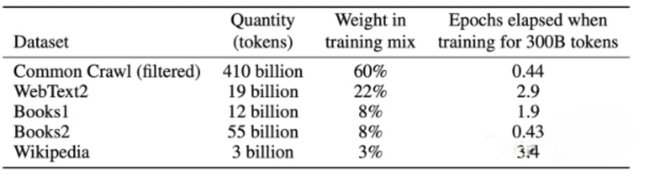

GPT-3沿用了GPT-2的模型结构，采用交替密度和局部带状稀疏注意模式。但在容量上有很大的提升。滑动窗口长度提升至2048个token，采用了96层的transformer，词向量的长度是12888。

### 1.2.2 微调
#### 1.2.2.1 Fine-tuning：

Fine-tuning是将预训练语言模型应用于特定任务或领域的技术。该方法使用大量文本训练好的模型，对小规模任务文本进行微调[5]。Fine-tuning最初在神经机器翻译中应用，通过预训练的神经网络初始化较小网络权重，并进行特定翻译任务微调。经典的fine-tuning方法是将预训练模型与少量任务特定数据一起训练。fine-tuning量取决于预训练语料库和任务特定语料库之间的相似性。GPT模型在许多任务上进行了微调，包括语言建模、问答和摘要，并在这些任务上表现出最先进的性能。

#### 1.2.2.2  Parameter efficient fine-tuning：

PEFT，即参数高效的fine-tuning，旨在用尽可能少的参数和计算资源对预训练语言模型进行微调，是NLP中一组微调方法，相对于传统的fine-tuning方法，其所需资源更少[6]。这些方法包括蒸馏、适配器训练和渐进收缩，它们在参数效率、内存效率、训练速度和模型质量方面有所不同，对于研究人员和开发人员来说非常重要，因为他们可能需要在低资源设备上进行模型微调。蒸馏通过训练一个较小的模型来模仿一个较大的预训练模型的行为来实现，适配器训练通过添加到预训练模型中的小型神经网络来进行微调，而渐进收缩则涉及在微调期间逐渐减小模型的大小。

#### 1.2.2.3 Prompt-tuning：

Prompt-tuning是一种较为前沿的精调预训练语言模型的方法，重点是调整输入提示而非修改模型参数[7]。这种方法使预训练模型保持不变，只需通过设计和优化一组提示，即可使模型执行特定任务。与传统的fine-tuning相比，prompt-tuning修改程度更小，只调整模型的输入，因此计算成本更低，需要的资源和训练时间也更少，更为灵活，适用于各种任务。对于大规模模型如GPT-3，整体精调可能需要大量计算资源。一些值得注意的prompt-tuning技术包括前缀调整，可以通过学习连续提示实现高效的精调。传统的prompt-tuning侧重于手动制作适合特定任务的提示，而新技术提供了更系统化和高效的方式来适应输入提示，提高预训练模型在特定任务上的性能。

#### 1.2.2.4 Instruct-tuning

Prompt-Tuning和Instruction-Tuning都利用了语言模型中的知识来提高其性能，但它们的目标略有不同[8]。Prompt-Tuning旨在激发语言模型的补全能力，而Instruction-Tuning旨在激发语言模型的理解能力。Instruct-Tuning的主要优势之一是其在多任务学习方面的效果。通过在多个任务上精调模型，我们可以让模型学习到更通用的知识和技能，从而在面对新任务时具有更好的迁移能力。此外，与Prompt Tuning相比，Instruct-Tuning更加通用，因为它不仅仅限于某个任务的特定模板，而是可以在任何需要理解指令的任务中使用。但是Instruct-tuning 对模型的容量有要求，在大模型上表现出色，而在小模型上表现不佳。

### 1.2.3 基于人类反馈的强化学习（Reinforcement Learning with Human Feedback）
RLHF是旨在人类对语言模型的指令与人类意图对齐并生成无负面影响结果的技术。该算法在强化学习框架下实现，分为奖励模型训练和生成策略优化两个阶段[9]。
在奖励模型训练阶段，通过拟合人类偏好的奖励模型，以提示和回复作为输入，计算标量奖励值作为输出。在生成策略优化阶段，给定奖励模型，ChatGPT/InstructGPT通过反馈当前策略并引入KL惩罚项和预训练损失来进行训练，以生成高质量回复并防止过度优化。

# 2. ChatGPT，GPT4以及相关工作的发布
## 2.1 ChatGPT:技术开发与创新
### 2.1.1 Instruct GPT(GPT-3.5)

ChatGPT是基于GPT-3.5(Instruct GPT)架构开发的对话模型。Instruct GPT与GPT-3的主要区别在于加入了RLHF(Reinforcement Learning with Human Feedback)对模型进行精调。InstructGPT 模型采用了监督学习和强化学习技术的组合训练方式[10]。该模型的训练流程如图所示：

  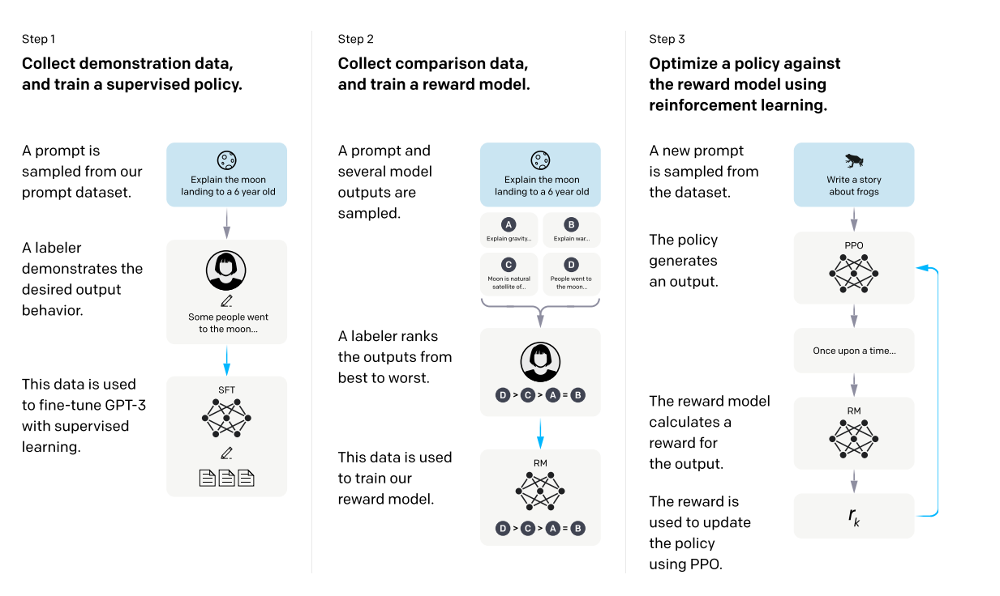

第一步，利用一个prompt dataset对GPT-3进行微调，以使其更好地适应特定的任务。第二步，训练奖励模型，使用标注员对GPT-3生成的结果进行人工标注，并将这些标注的结果用于训练奖励模型。第三步，使用PPO算法持续更新策略的参数，使其生成的文本能够获得更高的奖励分数。策略会将GPT-3生成的文本作为输入，通过奖励模型计算出相应的奖励分数，并利用这些分数来更新策略的参数。

数据集来源及数据量如图所示：

  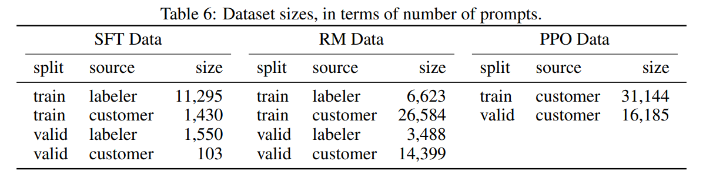

InstructGPT/ChatGPT相比于GPT-3更真实和无害。这是因为模型引入了labeler的提示编写和结果排序，同时在GPT-3的基础上进行微调，从而获得更真实的数据和更高的奖励。
尽管InstructGPT/ChatGPT可能会在通用NLP任务上降低模型的效果，并且有时会给出一些荒谬的输出，这可能是因为指示的数量和种类不充分，导致模型对简单概念的过分解读。此外，对有害的指示可能会输出有害的答复，这是因为InstructGPT/ChatGPT假设labeler编写的指示是合理且价值观正确的，没有对指示作详细的判断。从而会对任意输入都给出答复。

## 2.2 GPT-4：进一步改进和性能提升
GPT-4（Generative Pre-trained Transformer 4）是 OpenAI 发布的最新 GPT 系列模型[11]。它是一个大规模的多模态模型，可以接受图像和文本输入，产生文本输出。输出任务依旧是一个自回归的单词预测任务，这与外界之前的预期略微不同

相较于之前的模型，GPT-4的主要改进和性能提升表现在以下几个方面：

### 2.2.1 训练稳定性和预测性能
GPT-4 的开发经历了全面重建深度学习堆栈的过程，并与 Azure 共同设计了专门为其工作负载而优化的超级计算机。通过将 GPT-3.5 视为系统的首次“试运行”，OpenAI 发现并修复了一些错误，改进了理论基础。这使得 GPT-4 的训练运行非常稳定，并成为他们首个能够准确预测训练性能的大型模型。OpenAI 还计划持续专注于可靠的扩展，以进一步提高预测能力，为未来的应用做好准备。

### 2.2.2 模型性能
GPT-4 在许多专业和学术基准测试中展现出了显著的性能提升。举例来说，GPT-4 在模拟律师资格考试中的成绩超过了90%的考生，而 GPT-3.5 仅在后10%范围内。这表明 GPT-4 在解决复杂问题、创造性写作等方面具备更高的可靠性和灵活性。

### 2.2.3 多模态能力
一个关键的改进是 GPT-4 的多模态能力，即接受图像和文本输入。这使得 GPT-4 能够处理更广泛的应用场景，并结合图像和文本信息生成更丰富的输出。OpenAI 在技术报告中提供了多个实际交互示例，展示了 GPT-4 在图像理解、图像分类和问题回答等方面的能力。

### 2.2.4 安全性和可控性
OpenAI 在 GPT-4 的开发过程中重视了模型的安全性，并采取了多项措施以确保输出的真实性和符合期望的行为。他们通过引入对齐方案和加入额外的安全奖励信号，提高了模型的安全性能。此外，OpenAI 还邀请了多位专家对模型进行对抗测试，以发现并修复潜在的安全问题。

### 2.2.5 模型架构和训练方法
GPT-4 的架构与之前的 GPT 模型相似，采用了 Transformer 的结构。预训练阶段使用了公开可用的互联网数据和第三方提供的数据，并且在微调阶段应用了强化学习人类反馈（RLHF）来微调模型的行为。

### 2.2.6 引入了可预测的拓展并增强了安全性
GPT-4 引入了一个可预测扩展的深度学习栈，该栈能够在不同的规模下表现出可预测的行为。通过开发基础设施和优化方法，团队能够在小规模模型上进行实验，并准确地预测在大规模模型上的性能，提高了工作效率和模型性能。为提高模型的安全性，OpenAI 采取了多种措施。他们引入了对齐方案和安全奖励信号，并对模型进行了对抗测试。这些举措大大提高了 GPT-4 的安全性能，减少了生成有害内容的风险。

## 2.3 关于副本ChatGPT的相关工作-LLaMA，Alpaca,和Vicuna
### 2.3.1 LLaMA
LLaMA是Meta于2023年2月发布的模型集合，参数量分别是7B，13B，33B和65B，其中LLaMA-13B在大多数数据集上超过了GPT3（175B），LLaMA-65B达到了和Chinchilla-70B、PaLM-540B相当的水平[12]。LLaMA模型所使用的训练语料都是开源语料（1.4T tokens）；
模型结构上，LLaMA在Transformer-Decoder-Only基础上引入预归一（参考GPT3）、SwiGLU激活函数（参考PaLM）和旋转位置编码（参考GPTNeo）；算力资源上，65B模型使用2048张A100 80G，按照每张卡每秒处理380个token来算，训完1.4T token需要21天。

下面这张表格列举了用于预训练的数据混合，对于每个子集，表格列出了采样比例、在1.4T令牌上训练时在子集上执行的历元数以及磁盘大小。

  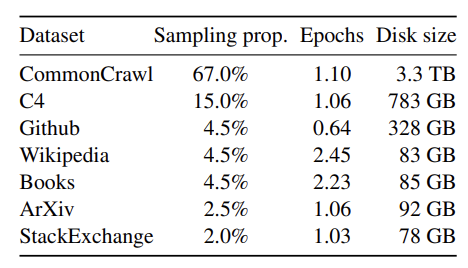

各个版本模型的参数量对比：

  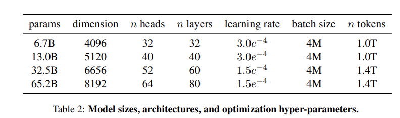

各个版本模型的训练损失：

  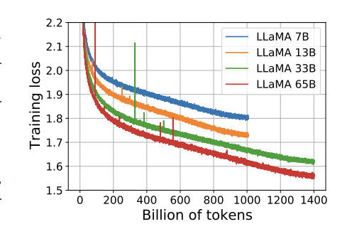

LLaMA在各项任务上展现出了强大的性能：

常识推理：在多个常识推理基准测试中，LLaMA-65B几乎无一例外地超过了Chinchilla-70B和PaLM-540B。令人惊讶的是，尽管LLaMA-13B的规模较小，但其性能仍优于GPT-3。
闭卷问题回答：在Natural Questions和TriviaQA这两项测试中，LLaMA-65B无论在zero-shot还是few-shot任务上都表现出色。同时，规模较小的LLaMA-13B在这些测试上也与GPT-3和Chinchilla相当。

阅读理解：LLaMA在RACE阅读理解测试中展现出了优秀的性能，LLaMA-65B与PaLM-540B相当，而LLaMA-13B甚至优于GPT-3。

数学推理：在数学推理测试中，即使没有进行数学数据的微调，LLaMA-65B的性能也超过了Minerva-62B。

代码生成：LLaMA在根据自然语言描述生成代码的任务上表现强劲，在HumanEval和MBPP测试中，LLaMA-13B甚至超过了LaMDA 137B，而LLaMA-65B则优于PaLM-62B。

大规模多任务语言理解：在大规模多任务语言理解测试中，LLaMA-65B的性能略逊于Chinchilla-70B和PaLM-540B。

偏见、毒性和错误信息：虽然大型语言模型被证明可能会复制和放大训练数据中的偏见，生成有毒或冒犯性的内容，但根据一些评估，LLaMA在这方面的风险较低。

总的来说，LLaMA在各个任务和测试中都表现出了优秀的性能和鲁棒性，即使在较小规模的版本中也同样表现出色。

### 2.3.2 Alpaca
Alpaca是由斯坦福研究团队研发的大型语言模型，特殊之处在于其基于Meta AI的LLaMA模型进行构建，并进一步通过指令微调（Instruction-tuning）技术进行优化[13]。令人印象深刻的是，Alpaca仅利用大约52,000条指令作为训练数据，就实现了与GPT-3.5（text-davinci-003）相当的性能。

这些训练数据，其实是由OpenAI的text-davinci-003模型生成的，具体方法叫做Self-instruct。通过这样的训练，Alpaca不仅成功模仿了text-davinci-003的行为模式，而且它的模型规模相较于text-davinci-003明显缩小，这就使得复制这个模型变得更容易、更经济。

值得注意的是，Alpaca的训练过程中遇到了两大挑战：一是要有一个强大的预训练语言模型，二是需要高质量的指令调优数据。幸运的是，这两大挑战都得到了解决。Meta的新型LLaMA模型为第一个问题提供了答案，而第二个问题则通过利用现有的强大语言模型来自动生成指令数据的方法得到了解决。下面这张图展示了Alpaca的训练过程：

  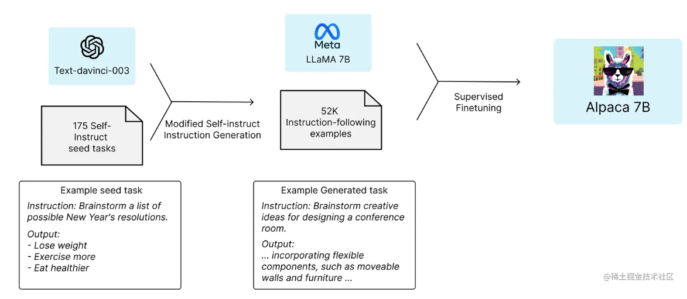

首先基于175个人工编写的指令-输出对作为Self-instruct的种子集，然后利用这个种子集引导text-davinci-003生成更多的指令。通过优化Self-instruct方法，如简化生成pipeline，他们显著地降低了成本。随后，他们使用OpenAI API生成了52K不重复的指令和对应输出，总成本低于500美元。最终，研究团队利用Huggingface框架以及Fully Sharded Data Parallel和Mixed Precision Training两项技术对LLaMA模型进行了微调。

当然，Alpaca并非完美。尽管在评估中它展现出了与text-davincii-003相似的性能，但它也同样存在一些普遍的语言模型问题，比如幻觉、毒性和刻板印象等。然而，Alpaca的发布无疑为整个社区带来了一个轻量级的模型，为我们提供了一个研究这些问题的重要基础。

### 2.3.3 Vicuna
Vicuna-13B是一个开源聊天机器人，由研发团队通过在用户从ShareGPT共享的对话中微调LLaMA来训练而成[14]。使用GPT-4作为评判工具的初步评估表明，Vicuna-13B在90%以上的情况下达到了OpenAI ChatGPT和Google Bard的90%的质量，并且在90%以上的情况下优于其他模型，如LLaMA和Stanford Alpaca。训练Vicuna-13B的成本大约为300美元。

Vicuna-13B通过在约70K用户共享的ChatGPT对话中微调Vicuna，生成比Alpaca更详细、结构更完整的答案，其质量与ChatGPT相当。然而，评估聊天机器人并不是一项简单的任务。随着GPT-4的最新进展，研发团队好奇其是否已经达到了人类水平的能力，能否为生成基准和性能评估提供一个自动化的评估框架。初步发现表明，GPT-4能够在比较聊天机器人的答案时产生高度一致的排名和详细的评估。

下面这张图比较了不同模型之间的回复质量：

  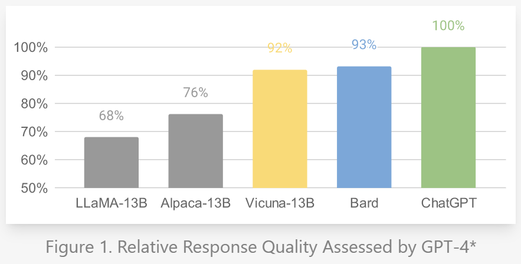

Vicuna-13B是由LLaMA基础模型微调创建的，使用了从ShareGPT.com收集的大约70K用户共享的对话和公共API。为了确保数据质量，研发团队将HTML转换回markdown，并过滤掉一些不适当或质量低的样本。此外，他们将长对话分割成适应模型的最大上下文长度的小段。研发团队采用了在斯坦福的Alpaca上进行的训练方式，其中包括以下几点改进：

内存优化：为了让Vicuna能够理解长上下文，研发团队将Alpaca的最大上下文长度从512扩大到2048，这大大增加了GPU内存的需求。他们通过使用梯度检查点和flash attention来解决内存压力问题。

多轮对话：研发团队调整了训练损失，以考虑到多轮对话，并仅在聊天机器人的输出上计算微调损失。

通过Spot Instance减少成本：使用40倍大的数据集和4倍的序列长度进行训练对训练费用提出了很大的挑战。研发团队利用由SkyPilot管理的spot实例，通过利用更便宜的spot实例进行预防和自动区域切换来降低成本。这个解决方案将训练7B模型的成本从500美元降低到了大约140美元，将13B模型的成本从大约1000美元降低到了300美元。

下面这张图比较了LLaMA，Alpaca，Vicuna与ChatGPT

  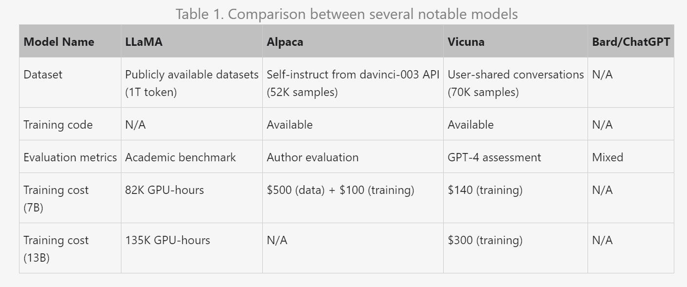

下面这张图展示了Vicuna的训练方式：

  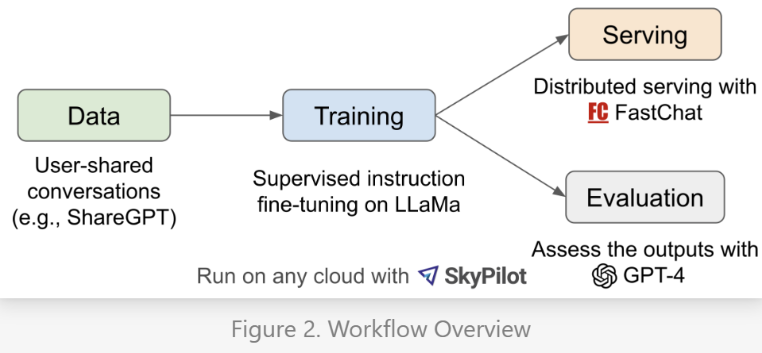

首先，研发团队从ShareGPT.com收集了大约70,000个对话，这是一个让用户分享他们的ChatGPT对话的网站。接着，研发团队改进了Alpaca提供的训练脚本，以更好地处理多轮对话和长序列。研发团队在一天内使用8个A100 GPU进行了训练，利用PyTorch FSDP进行了加速。为了提供演示服务，研发团队实现了一个轻量级的分布式服务系统。通过创建80个不同的问题，并利用GPT-4来评估模型输出，对模型的质量进行了初步评估。

尽管取得了一些进展，这些聊天机器人仍然存在一些局限性，比如处理基本数学问题的困难或编程能力的有限。虽然该评估框架展示了评估聊天机器人的潜力，但它还不是一种严格或成熟的方法，因为大型语言模型容易输出错误信息。开发一个全面的、标准化的聊天机器人评估系统仍然是一个需要进一步研究的开放问题。

## 2.4 ChatGPT的相关下游应用文
需求信息检索： ChatGPT已被用于需求工程，从涉及多种语言的不同类型的工件中检索需求信息[15]。

对话理解： ChatGPT已经被评估为口语理解（SLU）和对话状态跟踪（DST）等任务。它在多轮DST任务中的表现比单轮SLU任务更好[16]。

作文写作： ChatGPT已被用于生成论证性文章。在一项研究中，ChatGPT生成的文章在质量上比人类写的文章评价更高[17]。

文本数据增强： ChatGPT已经被用来将训练样本中的每一句话改写成多个概念相似但语义不同的样本。增强后的样本可用于下游的模型训练[18]。

抽象化的总结： ChatGPT分析文本中的情感的能力已经得到了评估。它在情感分类任务中表现出令人印象深刻的零点性能[19]。

机器翻译： ChatGPT已被评估为机器翻译，并与商业翻译产品进行了比较[20]。

语法错误纠正： ChatGPT在语法错误纠正（GEC）任务中的表现已经得到了评估[21]。

编程协助： ChatGPT已被评估为代码生成、程序修复和代码总结任务的编程助手[22]。

# 3 后GPT时代
## 3.1 Phonenix模型和HuatuoGPT(Ours)
### 3.1.1 Phoenix语言模型
Phoenix语言模型是一种开源的多语言聊天模型，是由香港中文大学深圳数据科学学院和深圳大数据研究院的团队研发的[23]。它的目标是扩展大型语言模型（LLM）到多种语言，特别是非拉丁语言。Phoenix模型的开发是为了实现ChatGPT的民主化，使其更加易于访问，特别是在由于OpenAI或本地政府的限制而无法使用ChatGPT的国家。使更多的研究人员能够参与ChatGPT的研究，并分享他们的多样化思考。
#### 3.1.1.1 模型设计
Phoenix语言模型是一种大型语言模型，其设计目标是在多种语言中实现与ChatGPT相当的性能，特别是在非拉丁语言中。Phoenix的设计理念源于中国文化中的凤凰，凤凰被视为能理解和说出数百种（鸟类）语言的象征。

Phoenix模型的设计包括以下几个关键部分：

多语言性能：Phoenix在中文中实现了开源大型语言模型中的最新技术。在非拉丁语言中，Phoenix在许多语言中大大超过了现有的开源大型语言模型，包括阿拉伯语、日语和韩语。然而，Phoenix在拉丁语和西里尔语中并未实现最先进的结果，这是因为Phoenix在处理非拉丁或非西里尔语言时额外支付了“多语言税”。

Chimera：为了减少在拉丁语和西里尔语中的多语言税，Phoenix的拉丁语版本被称为“Chimera”。在英语基准测试中，Chimera在GPT-4中达到了96.6%的ChatGPT质量，这在开源大型语言模型中设定了新的最高标准。

训练方法：Phoenix模型的训练方法包括在后训练阶段同时利用指令和对话数据。实验结果证明了同时使用这两种数据的有效性。Phoenix在预训练和指令微调阶段使用了丰富的多语言数据。

评估：Phoenix模型的评估包括自动评估和人工评估。在自动评估中，使用GPT-4作为评审员对每个答案的有用性、相关性、准确性和详细程度进行评分。在人工评估中，要求评估参与者对每个模型的生成结果的整体性能进行判断。

#### 3.1.1.2 训练方法
Phoenix模型的训练方法主要包括以下几个步骤：

指令基础调整：指令调整的目标是使语言模型遵循人类的指令，这些指令可能是手动设计的，或者是以混合的方式，人类编写一些种子指令，然后使用OpenAI ChatGPT在上下文学习中生成更多类似的指令。

对话基础调整：使用ChatGPT提炼的对话来教语言模型像OpenAI ChatGPT那样聊天，而指令数据通常用于单轮问题回答。

多语言训练：这一部分是特别的，主要的挑战是收集足够的多语言数据。为了解决这个问题，对于指令跟踪数据，我们收集语言不可知的指令，并根据现实语言的概率分布将它们翻译成其他语言，使用两种方式，即后翻译或后回答。前者可以确认答案的质量，后者可以引入语言/文化特定的答案。对于对话数据，我们从各种来源和多种语言中收集用户共享的对话。通过这样的设计，我们可以在多语言环境中训练我们的模型。

#### 3.1.1.3 模型性能
Phoenix模型在中文中实现了开源大型语言模型中的最新技术。在非拉丁语言中，Phoenix在许多语言中大大超过了现有的大型语言模型，包括阿拉伯语、日语和韩语。然而，Phoenix在拉丁语和西里尔语中并未实现最先进的结果，这是因为Phoenix在处理非拉丁或非西里尔语言时额外支付了“多语言税”。

为了减少在拉丁语和西里尔语中的多语言税，Phoenix的拉丁语版本被称为“Chimera”。在英语基准测试中，Chimera在GPT-4中达到了96.6%的ChatGPT质量，这在开源大型语言模型中设定了新的最高标准。

Phoenix模型在多种语言中的击败率(Beat Rate)显示，Phoenix在大多数语言中都对Guanaco模型具有绝对优势，该模型也是多语言的。由于较少的多语言税，Phoenix的拉丁版本（Chimera）在拉丁语言中表现得更好，与GPT-3.5 Turbo相当，甚至在法语和西班牙语中稍微优于GPT-3.5 Turbo。

下图是Phoenix模型与其他语言模型在中文和英文上的表现比较：

  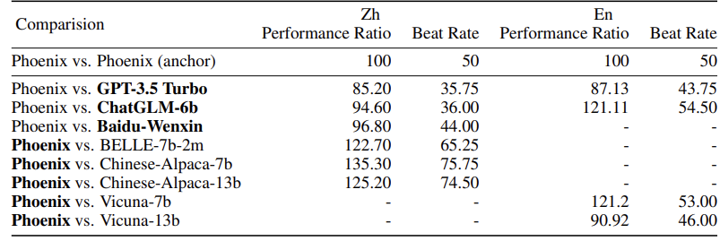

下图是Phoenix模型在多种语言中与其他语言模型的击败率:

  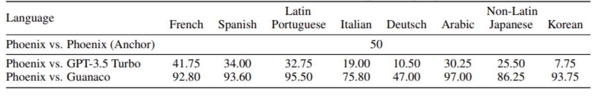

  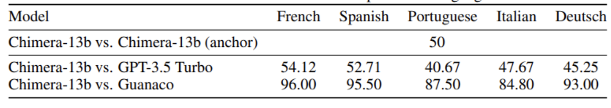

### 3.1.2 HuatuoGPT
HuatuoGPT是一种大型语言模型，专门用于医疗咨询[24]。它的核心理念是在监督微调阶段同时利用ChatGPT的蒸馏数据和医生的实际数据。开发团队来自香港中文大学（深圳）和深圳大数据研究院。
#### 3.1.2.1 模型概述
HuatuoGPT的核心理念是在监督微调阶段同时利用ChatGPT的蒸馏数据和医生的实际数据。ChatGPT的回应通常详细、清晰、信息丰富，但在许多方面无法像医生那样进行综合诊断。因此，HuatuoGPT认为医生的实际数据可以补充蒸馏数据，使蒸馏的语言模型表现得更像医生。为了更好地利用这两种数据的优点，HuatuoGPT采用了一种名为RLAIF（强化学习自AI反馈）的方法，通过训练奖励模型来使语言模型与两种数据的优点保持一致。
#### 3.1.2.2 训练方法
- 华佗模型（HuatuoGPT）的训练方法主要包括以下几个步骤：

- 监督微调阶段：在这个阶段，华佗模型同时利用了ChatGPT的蒸馏数据和医生的实际数据。ChatGPT的回应通常详细、清晰、信息丰富，但在许多方面无法像医生那样进行综合诊断。因此，华佗模型认为医生的实际数据可以补充蒸馏数据，使蒸馏的语言模型表现得更像医生。

- 强化学习自AI反馈（RLAIF）：为了更好地利用这两种数据的优点，华佗模型采用了一种名为RLAIF的方法，通过训练奖励模型来使语言模型与两种数据的优点保持一致。具体来说，华佗模型使用大型语言模型来对生成的回应进行评分，基于其正确性、丰富性、逻辑一致性和诊断能力，以使模型与ChatGPT和医生的优点保持一致。

- 评估：华佗模型提出了一种全面的评估方案，包括自动和手动指标。实验结果表明，华佗模型在GPT-4评估、人工评估和医疗基准数据集中的医疗咨询表现中取得了最好的结果。

- 消融研究：华佗模型进行了消融研究，探索了两种类型的数据（真实数据和蒸馏数据）对模型的影响。他们训练了两个不同的模型，分别只使用真实世界数据或蒸馏数据。结果显示，使用真实数据的华佗模型倾向于向患者提问，表现得像医生，但回应较简短，内容组织不够良好。而使用蒸馏数据的华佗模型生成的内容组织良好，详细且信息丰富，但其回应更侧重于提供建议，而不是进行诊断决策。因此，使用蒸馏数据的华佗模型更像一个"非医生朋友"，而不是医生。
具体训练过程如图所示：

  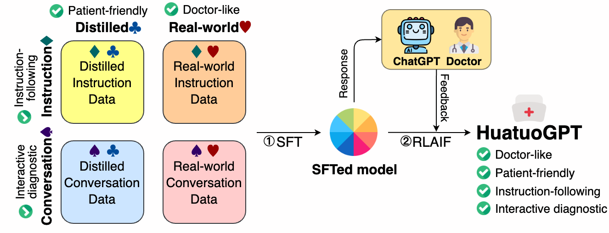

#### 3.1.2.3 模型性能
华佗模型在GPT-4评估、人工评估和医疗基准数据集中的医疗咨询表现中取得了较好的结果。在进行医疗咨询的过程中，华佗模型比DoctorGLM、BenTsao和GPT-3.5-turbo得分更高。在多轮对话评估中，华佗模型的总体性能超过了GPT-3.5-turbo的60%以上的情况。在华佗模型的手动评估中，考虑了以下三个方面：诊断准确性、治疗建议的准确性、药物知识和处方的准确性。这些评估指南使医生能够对不同模型的优点和缺点进行细致的比较。华佗模型在单轮医疗咨询的手动评估中，表现出色，对比BenTsao、DoctorGLM，甚至略微超过ChatGPT，突显出其强大的诊断准确性、治疗建议和药物知识。在多轮对话评估中，华佗模型在扩展对话上下文中表现出色，对比DoctorGLM和ChatGPT的胜率分别为86%和58%，这表明华佗模型在病人咨询场景中具有更突出的交互式诊断能力。

部分评估数据如下图所示：
<figure class="half">
    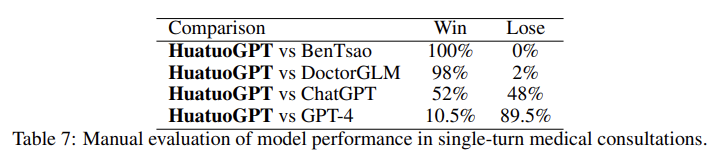
    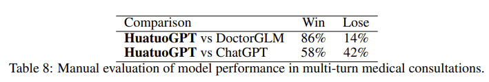
</figure>

## 3.2 部分开源模型的详细介绍
### 3.2.1 GLM[25]
GLM与GPT系列模型类似，采用了Decoder-Only 结构。与GPT不同的是，为了提升GLM的文本理解能力，GLM预训练时采取了自回归空白填充的方法，并把自然语言理解的分类任务转化为填空生成任务来对模型进行微调。针对不同训练语料，GLM还采用了多任务训练。
#### 3.2.1.1 预训练——自回归空白填充
用一个例子可以比较直观的理解自回归空白填充的实现方式。如下图所示，在实现自回归空白填充时，输入被分成两部分，其中Part A是被破坏的文本，Part B是被masked的文本片段。在Mask Self-Attention中，Query 中的Part A可以看到它本身的所有内容，但它看不到Part B中的任何内容。Query的Part B可以看到Part A的所有内容，以及当前position之前的内容，但它不能看到当前position之后的内容。为了能够对文本片段进行自回归的生成，GLM在文本片段的首尾分别添加了[START]和[END]标志，分别用于输入和输出。同时，在对输入进行position embedding的时候，同时考虑了inter-position和intra-position，从而更精确的保存位置信息。
  
自回归空白填充的具体计算过程如下：  
1. 对于一个文本序列x = [x1, ..., x6]，我们对其进行mask，假设mask 掉的
token是[x3]和[x5, x6]
2. 将[x3] 和[x5, x6] 替换为[M] 标志，并且打乱Part B 的顺序
3. 将Part A和打乱后的Part B拼接到一起，自回归的生成Part A和Part B，其中Part B中的每个文本片段加上起始标志[S]和终止标志[E]
4. 使用Mask Self Attention控制当前位置能Attend到的文本
#### 3.2.1.2 预训练——多任务训练
对于不同的训练语料，GLM通过不同的mask方式，实现多种不同任务的训练。参与GLM预训练的任务可以分为两类，分别是document-level的任
务和sentence-level的任务。  
1. Document-level：只mask一个文本片段，这个文本片段的长度是原始文本长度50% 到100% 的均匀分布，这个任务旨在学习模型的长文本生成能力
2. Sentence-level：这里mask的文本片段必须是一个完整的句子，很多个句子会被mask，直到达到原始文本的15%。这个任务旨在学习模型预测完整句子的能力
#### 3.2.1.3 模型训练——微调
GLM 的模型微调时，将自然语言理解的分类任务转化为填空生成任务。具体来讲，对于一个文本分类样本(x, y)，我们将输入文本x转化为单个单词的预测任务。例如下图所示的情感分类任务，我们将标签y映射为填空题的答案，其中正标签（positive label）和负标签（negative label）对应的单词分别是good和bad。这里使用交叉熵来构造损失函数。  

#### 3.2.1.4 训练数据集
GLM 的训练数据集参考[GLM Github repository](https://github.com/THUDM/GLM/blob/main/data_utils/corpora.py)，包括：  

### 3.2.2 Baichuan[26]
Baichuan模型有1和2两个版本，每个版本都有7B/13B两种参数量不同的模型。Baichuan的模型结构主要是参照LlaMa 进行的改动，模型框架基本一致，也是沿用的Decoder-Only的结构。但Baichuan在tokenizer，positional embedding，和normalization上做了一些调整。

#### 3.2.2.1 Tokenizer
Tokenizer的作用是通过查表把input text转化成表中对应token的位置。一个好的tokenizer要满足两个条件。首先，tokenizer要有一个高的压缩率以便于模型能够高效的推断。换句话说，就是token的设计要对输入的文本有一定的压缩能力，而并不是让模型直接去理解每一个字符（这样会导致模型参数量很大），从而降低推断效率。而token的设计又不能过于简练，使得输入文本在转化为token的过程中会有信息的遗失，从而使模型的效果变差。  

Baichuan把tokenizer中表的词汇量从Llama的32000拓展到Baichuan1的64000和Baichuan2的125696（tokenizer中表的词汇量与token如何设
计直接相关），力图在推断效率和模型效果之间寻找一个平衡。

#### 3.2.2.2 Positional Embeddings 和 Normalization
Llama的positional embedding使用的是旋转型位置编码（RoPE），这种编码能够将相对位置信息依赖集成到self-attention中并提升transformer架构的性能。Baichuan1和2的7B模型沿用了这种positional embedding方式，Baichuan1和2的13B模型则选用了ALiBi位置编码。ALiBi 是一种较新的位置编码技术，其具有较强的外推性能（此处的外推性能是指，假设训练数据中最长的文本序列为2048个tokens，训练出的模型也能处理更长的文本序列）。为了提高提高warm-up的鲁棒性，Baichuan对Transformer的输入进行了Layer Normalization。

#### 3.2.2.3 训练数据集
  

Baichuan在数据采集过程中，为了数据的全面性和代表性，从多个来源进行数据收集，包括但不限于网页、书籍、研究论文、代码等。以Baichuan2为例，各类别数据分布如上图所示。除此之外，相比Llama的1T英文tokens的预训练数据量，Baichuan增加了预训练数据量（Baichuan1和Baichuan2分别用了1.2T 和2.6T的中英tokens），并对数据进行了较为精细的清洗。

### 3.2.3 WizardLM[27]
WizardLM展示了使用LLM而不是人类创建具有不同复杂程度的大量指令数据的方法。从初始指令集开始，WizardLM团队使用他们提出的Evol-
Instruct方法逐步将其重写为更复杂的指令。然后，WizardLM混合所有生成的指令数据来微调LLaMA（指令微调）。
#### 3.2.3.1 Evol-Instruct
Evol-Instruct是一种使用LLM代替人类，自动大规模生成不同难度水平的开放域指令（此处开放域指令是一个相对于封闭域指令的概念，封闭域指令多以公共的NLP数据集为主）的新方法，以提高大型语言模型的性能。与Alpaca 的Self-instruct 方法（白皮书里有讲）不同，Evol-Instruct 可以控制生成指令的难度和复杂水平。  

如下图，从一个简单的初始指令“1+1=？”开始，Evol-Instruct方法随机选择“In-depth Evolving”（蓝色方向线）来升级简单指令为更复杂的指令或“In-breadth Evolving”（红色方向线）来创建新的指令（增加多样性）。  
- In-depth Evolving包括五种操作：添加约束条件、加深理解、具体化、增加推理步骤和复杂化输入。
- In-breadth Evolving是异化，即基于给定指令生成一个全新的指令。
- 由于进化指令是由LLMs生成的，有时会失败。WizardLM 团队采用instruction eliminator来过滤失败的指令，称为“Elimination Evolving”。
- 进化过程会重复多轮，以获得足够包含各种复杂性的指令数据。  

#### 3.2.3.2 模型训练——微调Llama
WizardLM团队采用类似于Alpaca和Vincuna的方法使用进化后的指令对Llama进行微调，通过评估其性能来验证Evol-Instruct方法，并把微调
后的模型命名为WizardLM。结果表明，在复杂的测试指令下，WizardLM的输出比ChatGPT的输出更受人欢迎。

### 3.2.4 UltraLLaMA[28]
UltraLLaMA是由清华微调Llama创建的英语对话模型。其主要贡献是构造了UltraChat数据集，下文会详细介绍。
#### 3.2.4.1 UltraChat
  

UltraChat 旨在涵盖范围广泛的指令和查询，它由三个部分组成: Questions about the World, Creation and Generation, 和Assistance on Existing Materials。  
- Questions about the World注重于查询世界上已有的信息，以支持人与AI之间的有效信息交换。这个部分数据的收集方法涉及两个方面:
以主题和概念为中心的话题生成以及以现实世界的实体为中心的问题生成。通过生成话题，子话题，以及从Wikidata派生的实体问题，UltraLM 团队构建了对话的开场白。在构建每个对话期间，模型以精心设计的提示作为输入，这些提示明确要求模型简洁而有意义地响应，同时考虑到正在进行的对话上下文。
- Creation and writing旨在根据用户指令创建新的信息文本材料。文本材料被分为20种不同的类型，ChatGPT模型用于为每种类型生成指
令。大约80%生成的指令被用于进一步反馈给ChatGPT，以生成更详细的指令，用作对话生成的开场白。在整个生成过程中，用户提示不断强化对话的主要目标，即生成和完善文本材料。这有助于确保模型的行为保持集中并与预期目的保持一致。
- Assistance on Existing Materials涉及处理与现有文本材料相关的各种任务，如重写、翻译、摘要和问答。UltraLM团队从C4语料库中
收集了大量文本片段，每个片段都与一个source URL相关联。为了确保文本内容和样式的多样性，UltraLM团队采用了上述文本材料的20种类型。随后，对于每个文本片段，他们提示ChatGPT生成5个不同的指令，并把文本片段与对应的指令结合起来。最终，所有文本片段和对应指令拼接而成的集合作为生成对话的开场白。
#### 3.2.4.2 模型训练——基于Llama
UltraLLaMA是基于LLaMA-13B，利用上述UltraChat数据集训练而成。在训练过程中，loss使用标准的cross-entropy loss，只有模型的回答会被用于计算loss。这个方式确保了模型能接触到对话前面部分相关的信息，使得模型对正在进行的谈话能有更综合和全面的理解。通过包含前文的背景，UltraLLaMA能生成更符合语境且自然的回答。

### 3.2.5 Humpback[29]
让LLM更好的遵循指令通常需要对大量人工注释的数据进行微调。最近的研究强调了人工标注数据质量的重要性。由于高质量的人工标注十分昂贵，往往只能允许在较为少量的数据上进行人工标注，再通过拓展标注的数据来获得更多数据。然而，在保障数据质量的同时，拓展高质量的人工标注数据是十分困难的。Meta AI的研究者提出了一种可扩展的方法即指令回译（instruction backtranslation），该方法通过自动注释指令来构建高质量数据集。Meta AI利用该方法构建的数据集微调Llama，并把得到的模型命名为Humpback。
#### 3.2.5.1 指令回译
该方法从种子模型和web语料库开始。种子模型首先用于"自增强"其训练集:对于每个web文档，它通过预测该文档能正确回答的指令来创建一个训练样本。直接在这些数据上进行训练的效果并不好，这既是由于人类手写的网络文本的质量参差不齐，也是由于生成指令中有部分噪声。为了解决这个问题，该方法证明了种子模型可以通过预测这些数据的质量来"自管理"新创建的增强数据集，然后可以仅在最高质量的数据上进行自训练。通过不断迭代该过程，改进的模型可以更好地生成和管理增强数据，并重新训练以产生更好的模型。指令回译的大致流程如下图所示：  
  
其中，"自管理"步骤的采用的prompt如下表：  

#### 3.2.5.2 模型性能
Meta AI团队比较了Humpback和其他指令微调模型（基准模型均为Llama 7B）对text-davaci-003的胜率，结果如下图所示：  
  
其中虚线表示指令微调的过程中使用了对更高级模型的蒸馏来构造数据，实线表示未使用蒸馏方法。

### 3.2.6 Mistral[30]
在快速发展的NLP领域中，训练更高性能的模型通常需要模型尺寸的增加。然而，这种升级倾向于增加计算成本和延长推理时间，从而增加了在实际场景中部署的障碍。因此，寻找能提供高水平性能和计算效率的平衡模型变得至关重要。Mistral AI团队研发的Mistral模型仅有7B大小，但在所有测试基准中都优于Llama2 13B，并在数学和代码生成方面超过了Llama 34B。在模型结构方面，Mistral模型使用了滑动窗口注意力机制和滚动缓存，这两个方法有利于在保证模型性能的同时减小模型尺寸。
#### 3.2.6.1 滑动窗口注意力机制（Sliding Window Attention）
  

如上图所示，Vanilla Attention就是传统的注意力机制，其操作次数在序列长度上是二次的，内存随着tokens的数量线性增加。在推理时，由于缓存可用性降低，这会导致更高的延迟和更小的吞吐量。为了缓解这个问题，Mistral AI团队使用滑动窗口注意力机制:每个token最多可以关注之前的的W个tokens(这里是W=3)。在每个Attention layer，信息可以通过W个tokens向前移动。因此，在k个Attention layer之后，信息最多可以向前移动k × W个tokens。
#### 3.2.6.2 滚动缓存 （Rolling Buffer Cache）
  

由于上述滑动窗口的窗口长度是固定的，滚动缓存就可以用节省缓存空间。缓存的大小固定为W，时间步长i的值存储在缓存i mod W的位置上。因此，当位置i大于W时，缓存中过去的值将被覆盖，并且缓存的大小停止增加。上图为W=3时候的一个示例。在文本序列长度为32k个tokens的情况下，这个方法能将缓存使用的内存减少8倍，而不会影响模型质量。

### 3.2.7 Xwin-LM[31]
Xwin-LM是以Llama2为基础进行微调的，该模型旨在开发和开源大语言模型的对齐技术，包括监督微调（SFT）、奖励模型（RM）、拒绝采样、人类反馈强化学习（RLHF）等。  
- Xwin-LM-70B：在AlpacaEval基准测试中对Davinci-003的胜率达到95.57%，在AlpacaEval中排名第一。也是第一个在AlpacaEval上超越GPT-4的模型。此外，它对上GPT-4的胜率为60.61。
- Xwin-LM-13B：在AlpacaEval上取得了91.76%的胜率，在所有13B模型中排名第一。
- Xwin-LM-7B：在AlpacaEval上取得了87.82%的胜率，在所有7B模型中排名第一。  

# 3.3 其他开源语言模型
Guanaco: 这是一个基于Meta的LLaMA 7B模型构建的高级指令跟随语言模型[32]。它扩展了Alpaca模型的初始52K数据集，增加了534,530个条目，覆盖了英语、简体中文、繁体中文（台湾）、繁体中文（香港）、日语、德语，以及各种语言和语法任务。这丰富的数据使Guanaco在多语言环境中表现出色。此外，Guanaco还扩展了其能力，现在支持视觉问题回答（VQA）。这个新功能允许模型解释和回应涉及文本和视觉输入的查询，
为用户提供更丰富、更互动、更全面的体验。

Dolly：这是一个大型语言模型，它的目标是将大型语言模型民主化，使每个公司都能拥有和定制自己的模型，以改进他们的产品[33]。Dolly模型的训练只需要30分钟，使用高质量的训练数据，而且不需要最新或最大的模型：Dolly模型只有60亿个参数，相比之下，GPT-3有1750亿个参数。Dolly模型的代码已经开源，可以在Databricks上重建。

ChatDoctor: 这是一个医疗领域的聊天模型，它基于LLaMA模型进行了微调，并使用了医疗领域的知识[34]。这个模型使用了100k真实的患者-医生对话进行微调，并添加了自主知识检索能力，例如使用维基百科或数据库作为知识库。微调后的模型在理解患者需求和提供知情建议方面表现出显著的改进。ChatDoctor模型基于Wikipedia和Database Brain，可以获取实时和权威的信息，并根据这些信息回答患者的问题，从而显著提高模型回应的准确性。

骆驼(Luotuo): 该项目是由冷子昂 @ 商汤科技, 陈启源 @ 华中师范大学 以及 李鲁鲁 @ 商汤科技发起的中文大语言模型开源项目，包含了一系列语言模型[35]。这个项目的初始目标，是研究使用跨语言数据在进行微调时，大语言模型发生的相关现象。

BELLE: 这是一个开源的中文对话大模型，其目标是促进中文对话大模型开源社区的发展，降低大语言模型、特别是中文大语言模型的研究和应用门槛[36]。BELLE更关注如何在开源预训练大语言模型的基础上，帮助每一个人都能够得到一个属于自己的、效果尽可能好的具有指令表现能力的语言模型。BELLE项目会持续开放指令训练数据、相关模型、训练代码、应用场景等，也会持续评估不同训练数据、训练算法等对模型表现的影响。

Linly: 项目包含了几个重要的模型，包括Chinese-LLaMA基础模型，ChatFlow中文对话模型，以及中文OpenLLaMA模型[37]。这些模型都是基于大规模语料库进行预训练的，具有强大的自然语言处理能力。特别是ChatFlow模型，它是专门用于处理中文对话的，能够在多轮对话、逻辑推理、知识问答等场景中表现出优秀的性能。

Baize: 这是一个开源聊天模型，它通过在自我对话数据上进行参数高效调优来提升性能[38]。Baize模型的创建过程包括利用ChatGPT与自身进行对话，以自动生成高质量的多轮对话语料库，然后利用这个语料库来提升开源的大型语言模型LLaMA。Baize模型在多轮对话中展示出良好的性能，并设有防护措施以最小化潜在风险。Baize模型可以在单个GPU上运行，使其对更广泛的研究者可用。

Koala: 这是一个由伯克利人工智能研究实验室的多个团队共同开发的对话模型[39]。它通过对网上收集的对话数据进行微调训练，包括与大型语言模型（例如ChatGPT）的对话，这些对话是用户在线分享的。Koala模型的目标是通过学习高质量的数据集来弥补小型模型的不足，可能甚至在未来匹配大型封闭源模型的能力。

Firefly（流萤): 这是一个开源的中文对话式大语言模型[40]。该模型使用指令微调（Instruction Tuning）在中文数据集上进行调优。使用了词表裁剪、ZeRO等技术，有效降低显存消耗和提高训练效率。在训练中，开发者使用了更小的模型参数量，以及更少的计算资源。为了提升模型在中华文化相关内容的表现，开发者构造了许多与中华文化相关的数据，如对联、作诗、文言文翻译、散文、金庸小说等。

MedAlpaca：这是一个开源的医学对话AI模型和训练数据集合[41]。这个项目的主要目标是利用大型语言模型（LLM）的能力，通过自然语言指令执行任务，从而避免用户需要具备编程能力。这种特性使医学专业人士能够无缝地与模型进行交互，并通过多样化的医学工作流程引导模型。  MedAlpaca的潜在应用包括帮助医学专业人士进行笔记记录，撰写出院信，从大量文档中检索信息，总结内容，以及将自由形式的文本转换为结构化格式。只要模型在足够数量的医学文档上进行了训练，它就可能具备从基础文本中提取准确信息以协助咨询的医学知识。此外，医学生的培训也可以从这些模型中受益，其中它们扮演了一个学习伙伴的角色，能够向学生提问或阐述复杂的主题。

BELLE，全称为"Be Everyone's Large Language model Engine"，是一个开源的大型语言模型引擎[42]。这个项目的目标是为开源聊天模型的综合评估填补空白，以便为这一领域的持续进步提供有力支持。在这个项目中，研究者选用了LLaMA作为基础模型，对全参数微调和基于LoRA的调优方法进行了实验性的比较。实验结果揭示，选择合适的基础模型、训练数据集的规模、可学习参数的数量以及模型训练成本均为重要因素。在实验过程中，研究者发现模型在数学任务上表现不佳，得分大多低于0.5。为了验证 LoRA 在特定任务上的适应能力，研究者使用增量0.25M数学数据集（math_0.25M）来调整指令遵循的大型语言模型。从实验结果可以看出，增量微调仍然表现更好，但需要更长的训练时间。LoRA和增量微调都提高了模型的整体性能。

MOSS，全称为Multi-Modal Open Source System，是一种开源的工具增强型对话语言模型[43]。它由复旦大学的OpenLMLab团队开发，主要用于实现人工智能助手的功能。MOSS的设计目标是提供一种可以理解和生成跨模态内容的模型，包括文本、语音、图像等。MOSS的工作原理基于自然语言处理技术，它可以理解用户的输入，然后生成相应的输出。这个过程中，MOSS可能会调用一些内置的工具或插件，例如网络搜索、计算器等，以帮助它完成任务。这种设计使得MOSS不仅可以处理一般的对话任务，还可以处理一些更复杂的任务，例如回答关于特定主题的问题或执行特定的操作。MOSS的另一个重要特性是它的个性化能力。OpenLMLab团队希望MOSS能够成为每个用户的专属助手，它可以在与用户的交互中持续学习，伴随用户的成长而成长。

InternLM，是一个由上海AI实验室与商汤科技联合香港中文大学和复旦大学推出的开源轻量级训练框架[44]，旨在支持大模型训练而无需大量的依赖。通过单一的代码库，它支持在拥有数千个GPU的大型集群上进行预训练，并在单个GPU上进行微调，同时实现了卓越的性能优化。在1024个GPU上训练时，InternLM可以实现近90%的加速效率。  

Falcon，是由位于阿联酋阿布扎比的技术创新研究院创建的一系列语言模型[45]。具体训练数据中，Falcon主要是RefinedWe数据集(占比大于70%）。此外，它还在对话、技术论文，以及一小部分代码等经过整理的混合数据的基础上进行了训练。关于模型效果，以Falcon 180B为例，其在推理、编码、熟练度和知识测试各种任务中，一举击败Llama 2，甚至能够与谷歌的PaLM 2不差上下，性能直逼GPT-4。

模型|模型大小|所基于的模型|支持语言|模型模态
--|--|--|--|--
Guanaco|7B|LLaMA|英语/简体中文/繁体中文（台湾）/繁体中文（香港）/日语/德语|文本/视觉
Dolly|6B|GPT-J-6B|--|文本
ChatDoctor|7B|LLaMA|--|文本
LuoTuo|7B|LLaMA|中文/英文|--
BELLE|7B|BLOOMZ-7B1-mt|中文|文本
Linly (伶荔)|7B/13B/33B|LLaMA|中文|文本
BAIZE|7B/13B/30B|LLaMA|英文|文本
Koala|13B|LLaMA|英文|文本
Firefly (流萤)|1.4B/2.6B|BLOOM-ZH|中文|文本
Dolly|12B|pythia-12b|--|文本
MedAlpaca|7B/13B|LLaMA|英文|文本
BELLE|7B/13B|LLaMA|中文/英文|文本
MOSS|16B|CodeGen|中文|文本/语音/图像
InternLM|7B/20B|--|中文/英文|文本
Falcon|7B/40B/180B|--|英语/德语/西班牙语/法语|文本

# 4 未来研究方向
ChatGPT是一种大型语言模型，用于生成与人类对话。它已经被广泛地用于各种应用，包括客户服务、创作援助、教育等。然而，尽管当前的ChatGPT已经相当强大，但仍有许多前景广阔的研究方向值得我们探索，以进一步提升其性能。以下是未来的一些研究方向

垂直领域的ChatGPT：虽然ChatGPT能够处理各种主题，但它在处理特定领域问题时可能不如专门针对那个领域训练的模型那么精确。例如，医疗、法律、科技、金融等领域都有其特定的术语和知识。针对这些领域进行特定的训练，可以更准确地回答相关问题。这种研究方向可能需要收集大量的领域特定对话数据，或者开发新的迁移学习方法，以便从现有的大型语言模型中获得知识。

支持插件/外部控制的GPT：像HuggingGPT或AutoGPT这样的系统，可以让用户更直接地控制GPT的行为，例如设置特定的生成偏好、插入特定的对话框架、或者在特定的上下文中指导模型的生成。这种研究方向可能需要开发新的模型架构，或者研究如何将人类反馈更有效地融入模型训练中。

多模态GPT：这种研究方向涉及到将GPT扩展到处理多种类型的数据，例如语音（SpeechGPT）、图片（ImageGPT）或者视频。这可能需要开发新的模型架构，以处理不同类型的输入和输出，也可能需要收集大量的多模态数据。

GPT和虚拟人结合：虚拟人（也被称为虚拟助手、虚拟角色或者虚拟演员）是一种可以模拟人类外貌、语音和行为的计算机程序。将GPT和虚拟人结合，可以让虚拟人生成更自然、更人性化的对话。这种研究方向可能需要开发新的模型架构，以处理语音和视觉输入，也可能需要研究如何在虚拟环境中模拟人类的社会和情感行为。

GPT和机器人结合：将GPT与实体机器人（如服务机器人或家庭机器人）结合，可以使机器人具有更高级的对话能力。例如，机器人可以理解复杂的指令，提供有用的建议，或者参与更深度的对话，代替人类做一些有风险的工作。

# 参考文献
> [1] Radford, A., Narasimhan, K., Salimans, T., & Sutskever, I. (2018). [Improving language understanding by generative pre-training](https://www.runoob.com/markdown/md-link.html).
> 
> [2] Radford, A., Wu, J., Child, R., Luan, D., Amodei, D., & Sutskever, I. (2019). [Language models are unsupervised multitask learners](https://d4mucfpksywv.cloudfront.net/better-language-models/language-models.pdf). OpenAI blog, 1(8), 9.
> 
> [3] Brown, T., Mann, B., Ryder, N., Subbiah, M., Kaplan, J. D., Dhariwal, P., ... & Amodei, D. (2020). [Language models are few-shot learners. Advances in neural information processing systems](https://proceedings.neurips.cc/paper/2020/file/1457c0d6bfcb4967418bfb8ac142f64a-Paper.pdf), 33, 1877-1901.
> 
> [4] Vaswani, A., Shazeer, N., Parmar, N., Uszkoreit, J., Jones, L., Gomez, A. N., ... & Polosukhin, I. (2017). [Attention is all you need](https://proceedings.neurips.cc/paper/2017/file/3f5ee243547dee91fbd053c1c4a845aa-Paper.pdf). Advances in neural information processing systems, 30.
> 
> [5] Ziegler, D. M., Stiennon, N., Wu, J., Brown, T. B., Radford, A., Amodei, D., ... & Irving, G. (2019). [Fine-tuning language models from human preferences.](https://arxiv.org/pdf/1909.08593.pdf)) arXiv preprint arXiv:1909.08593.
> 
> [6] Liu, H., Tam, D., Muqeeth, M., Mohta, J., Huang, T., Bansal, M., & Raffel, C. A. (2022). [Few-shot parameter-efficient fine-tuning is better and cheaper than in-context learning.](https://proceedings.neurips.cc/paper_files/paper/2022/file/0cde695b83bd186c1fd456302888454c-Paper-Conference.pdf) Advances in Neural Information Processing Systems, 35, 1950-1965.
> 
> [7] Gu, Y., Han, X., Liu, Z., & Huang, M. (2021). Ppt: [Pre-trained prompt tuning for few-shot learning.](https://arxiv.org/pdf/2109.04332) arXiv preprint arXiv:2109.04332.
> 
> [8] Gupta, P., Jiao, C., Yeh, Y. T., Mehri, S., Eskenazi, M., & Bigham, J. P. (2022). [Improving zero and few-shot generalization in dialogue through instruction tuning.](https://arxiv.org/pdf/2205.12673) arXiv preprint arXiv:2205.12673.
> 
> [9] Knox, W. B., & Stone, P. (2008, August). Tamer: [Training an agent manually via evaluative reinforcement.](https://www.cs.utexas.edu/~pstone/Papers/bib2html-links/ICDL08-knox.pdf) In 2008 7th IEEE international conference on development and learning (pp. 292-297). IEEE.
> 
> [10] Ouyang, L., Wu, J., Jiang, X., Almeida, D., Wainwright, C., Mishkin, P., ... & Lowe, R. (2022). [Training language models to follow instructions with human feedback.](https://proceedings.neurips.cc/paper_files/paper/2022/file/b1efde53be364a73914f58805a001731-Paper-Conference.pdf)Advances in Neural Information Processing Systems, 35, 27730-27744.
> 
> [11] OpenAI. (2023). [GPT-4 Technical Report.](https://arxiv.org/pdf/2303.08774.pdf) arXiv:2303.08774
> 
> [12] Touvron, H., Lavril, T., Izacard, G., Martinet, X., Lachaux, M. A., Lacroix, T., ... & Lample, G. (2023). Llama: [Open and efficient foundation language models.](https://arxiv.org/pdf/2302.13971) arXiv preprint arXiv:2302.13971.
> 
> [13] Taori, R., Gulrajani, I., Zhang, T., Dubois, Y., Li, X., Guestrin, C., ... & Hashimoto, T. B. (2023). [Alpaca: A strong, replicable instruction-following model.](https://crfm.stanford.edu/2023/03/13/alpaca.html) Stanford Center for Research on Foundation Models. https://crfm. stanford. edu/2023/03/13/alpaca. html, 3(6), 7.
> 
> [14] Chiang, W. L., Li, Z., Lin, Z., Sheng, Y., Wu, Z., Zhang, H., ... & Xing, E. P. (2023). [Vicuna: An open-source chatbot impressing gpt-4 with 90%* chatgpt quality.](https://lmsys.org/blog/2023-03-30-vicuna/)
> 
> [15] Zhang, J., Chen, Y., Niu, N., & Liu, C. (2023). A Preliminary Evaluation of ChatGPT in Requirements Information Retrieval. arXiv preprint arXiv:2304.12562.
> 
> [16] Pan, W., Chen, Q., Xu, X., Che, W., & Qin, L. (2023). A preliminary evaluation of chatgpt for zero-shot dialogue understanding. arXiv preprint arXiv:2304.04256.
> 
> [17] Herbold, S., Hautli-Janisz, A., Heuer, U., Kikteva, Z., & Trautsch, A. (2023). AI, write an essay for me: A large-scale comparison of human-written versus ChatGPT-generated essays. arXiv preprint arXiv:2304.14276.
> 
> [18] Dai, H., Liu, Z., Liao, W., Huang, X., Cao, Y., Wu, Z., Zhao, L., ... (2023). AugGPT: Leveraging ChatGPT for Text Data Augmentation. arXiv:2302.13007 [cs.CL]
> 
> [19] Wang, Z., Xie, Q., Ding, Z., Feng, Y., & Xia, R. (2023). Is ChatGPT a good sentiment analyzer? A preliminary study. arXiv preprint arXiv:2304.04339.
> 
> [20] Jiao, W., Wang, W. X., Huang, J. T., Wang, X., & Tu, Z. P. (2023). Is ChatGPT a good translator? Yes with GPT-4 as the engine. arXiv preprint arXiv:2301.08745.
>
> [21] Fang, T., Yang, S., Lan, K., Wong, D. F., Hu, J., Chao, L. S., & Zhang, Y. (2023). Is chatgpt a highly fluent grammatical error correction system? a comprehensive evaluation. arXiv preprint arXiv:2304.01746.
> 
> [22] Tian, H., Lu, W., Li, T. O., Tang, X., Cheung, S. C., Klein, J., & Bissyandé, T. F. (2023). Is ChatGPT the Ultimate Programming Assistant--How far is it?. arXiv preprint arXiv:2304.11938.
>
> [23] Chen, Z., Jiang, F., Chen, J., Wang, T., Yu, F., Chen, G., ... & Li, H. (2023). Phoenix: Democratizing chatgpt across languages. arXiv preprint arXiv:2304.10453.
> 
> [24] Zhang, H., Chen, J., Jiang, F., Yu, F., Chen, Z., Li, J., Chen, G., Wu, X., Zhang, Z., Xiao, Q., Wan, X., Wang, B., & Li, H. (2023). HuatuoGPT: A Large Language Model for Medical Consultation. arXiv. https://arxiv.org/pdf/2305.15075.pdf
>
> [25] Du, Z., Qian, Y., Liu, X., Ding, M., Qiu, J., Yang, Z., & Tang, J. (2021). Glm: General language model pretraining with autoregressive blank infilling. arXiv preprint arXiv:2103.10360.
>
> [26]Yang, A., Xiao, B., Wang, B., Zhang, B., Yin, C., Lv, C., ... & Wu, Z. (2023). Baichuan 2: Open Large-scale Language Models. arXiv preprint arXiv:2309.10305.
> 
> [27]Xu, C., Sun, Q., Zheng, K., Geng, X., Zhao, P., Feng, J., ... & Jiang, D. (2023). Wizardlm: Empowering large language models to follow complex instructions. arXiv preprint arXiv:2304.12244.
> 
> [28]Ding, N., Chen, Y., Xu, B., Qin, Y., Zheng, Z., Hu, S., ... & Zhou, B. (2023). Enhancing Chat Language Models by Scaling High-quality Instructional Conversations. arXiv preprint arXiv:2305.14233.
>
> [29]Li, X., Yu, P., Zhou, C., Schick, T., Zettlemoyer, L., Levy, O., ... & Lewis, M. (2023). Self-alignment with instruction backtranslation. arXiv preprint arXiv:2308.06259.
>
> [30]Jiang, A. Q., Sablayrolles, A., Mensch, A., Bamford, C., Chaplot, D. S., Casas, D. D. L., ... & Sayed, W. E. (2023). Mistral 7B. arXiv preprint arXiv:2310.06825.
> 
> [31]Xwin-LM Team. (2023). Xwin-LM: Powerful, Stable, and Reproducible LLM Alignment. Retrieved from https://github.com/Xwin-LM/Xwin-LM
>
> [32] Guanaco - Generative Universal Assistant for Natural-language Adaptive Context-aware Omnilingual outputs. (2023). Retrieved from https://guanaco-model.github.io
> 
> [33] Conover, M., Hayes, M., Mathur, A., Meng, X., Xie, J., Wan, J., Ghodsi, A., Wendell, P., & Zaharia, M. (2023). Hello Dolly: Democratizing the magic of ChatGPT with open models. Databricks Blog. Retrieved from https://www.databricks.com/blog/2023/03/24/hello-dolly-democratizing-magic-chatgpt-open-models.html
> 
> [34] Li, Yunxiang, Li, Zihan, Zhang, Kai, Dan, Ruilong, & Zhang, You. (2023). ChatDoctor: A Medical Chat Model Fine-tuned on LLaMA Model using Medical Domain Knowledge. arXiv preprint arXiv:2303.14070v4.
> 
> [35] Chen, Q., Li, L., & Leng, Z. (2023). Camel (Luotuo): Open Sourced Chinese Language Models. Retrieved from https://github.com/LC1332/Luotuo-Chinese-LLM
> 
> [36] Ji, Y., Deng, Y., Gong, Y., Peng, Y., Niu, Q., Ma, B., & Li, X. (2023). BELLE: Be Everyone's Large Language model Engine. GitHub. https://github.com/LianjiaTech/BELLE
> 
> [37] CVI-SZU. (2023). Linly: Chinese-LLaMA基础模型；ChatFlow中文对话模型；中文OpenLLaMA模型；NLP预训练/指令微调数据集. GitHub. https://github.com/CVI-SZU/Linly
> 
> [38] Xu, C., Guo, D., Duan, N., & McAuley, J. (2023). Baize: An Open-Source Chat Model with Parameter-Efficient Tuning on Self-Chat Data. arXiv preprint arXiv:2304.01196.
> 
> [39] Geng, X., Gudibande, A., Liu, H., & Wallace, E. (2023, April 3). Koala: A Dialogue Model for Academic Research. The Berkeley Artificial Intelligence Research Blog. 
> https://bair.berkeley.edu/blog/2023/04/03/koala/
> 
> [40] Yang, J. (2023). Firefly(流萤): 中文对话式大语言模型. GitHub. https://github.com/yangjianxin1/Firefly
> 
> [41] MedAlpaca. (2023). An Open-Source Collection of Medical Conversational AI Models and Training Data. Preprint retrieved from https://arxiv.org/pdf/2304.08247.pdf
> 
> [42] Ji, Y., Deng, Y., Gong, Y., Peng, Y., Niu, Q., Ma, B., & Li, X. (2023). BELLE: Be Everyone's Large Language model Engine. GitHub repository. Retrieved from https://github.com/LianjiaTech/BELLE
> 
> [43] OpenLMLab. (2023). MOSS: An open-source tool-augmented conversational language model from Fudan University. Retrieved from https://github.com/OpenLMLab/MOSS
>
> [44] InternLM Team. (2023). InternLM: A Multilingual Language Model with Progressively Enhanced Capabilities. Retrived from https://github.com/InternLM/InternLM
> 
> [45] Almazrouei, Ebtesam and Alobeidli, Hamza and Alshamsi, Abdulaziz and Cappelli, Alessandro and Cojocaru, Ruxandra and Debbah, Merouane and Goffinet, Etienne and Heslow, Daniel and Launay, Julien and Malartic, Quentin and Noune, Badreddine and Pannier, Baptiste and Penedo, Guilherme. (2023). The Falcon Series of Language Models:Towards Open Frontier Models. Retrieved from https://huggingface.co/tiiuae/falcon-180B

